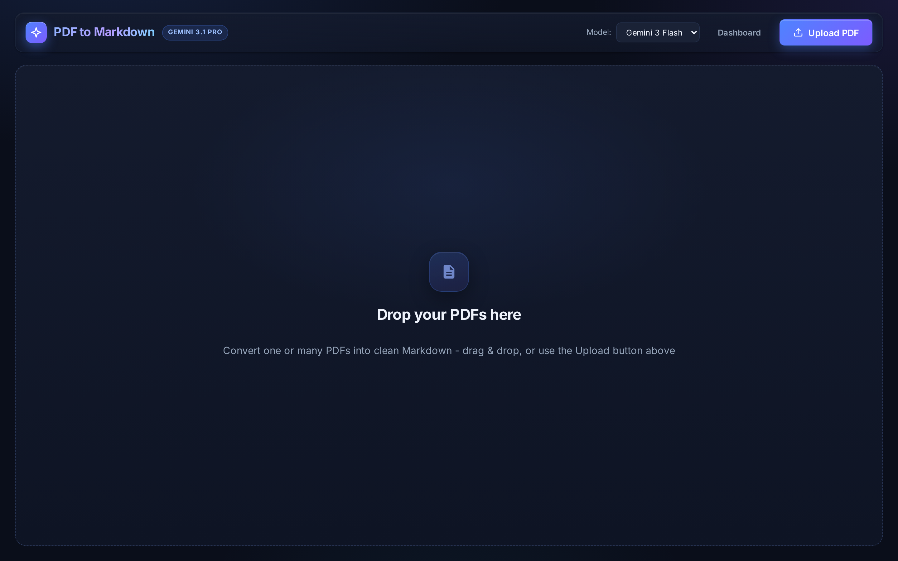
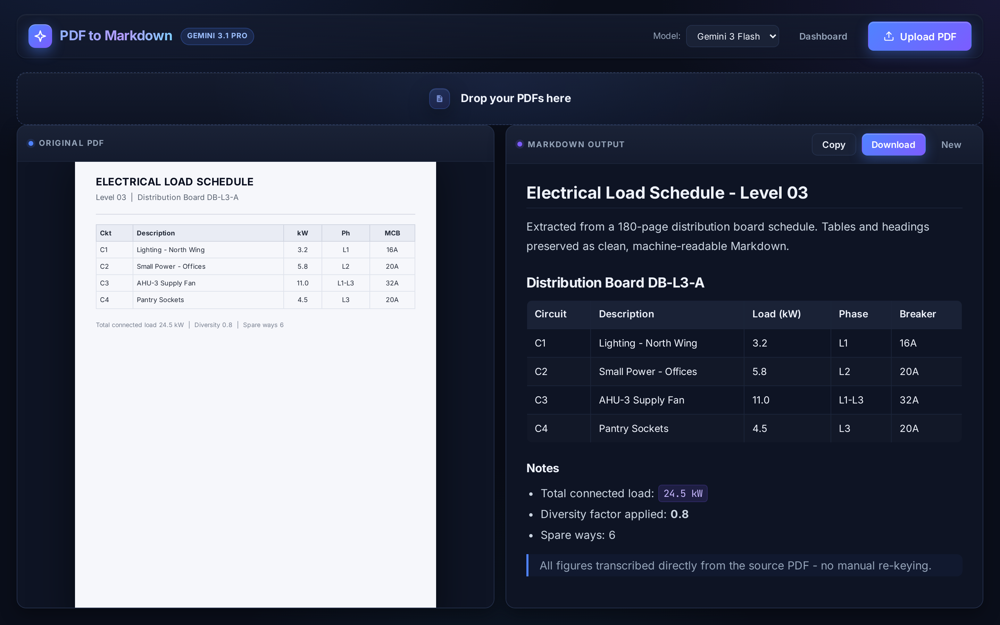
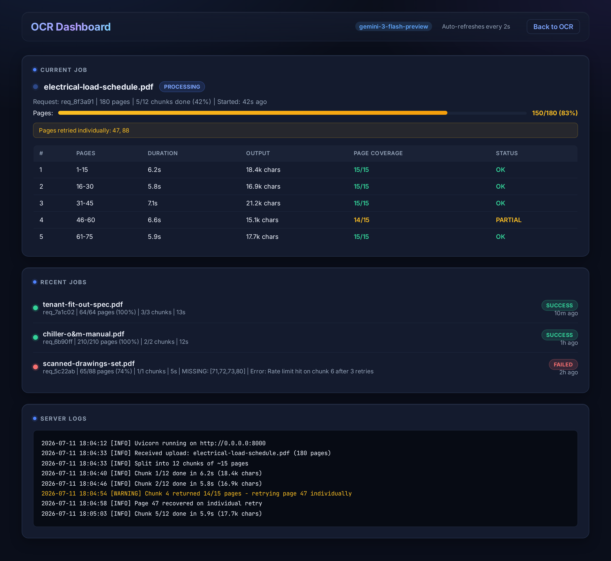

# PDF → Markdown OCR

Turn any PDF - including dense, table-heavy technical documents - into clean, machine-readable Markdown using Google Gemini's native multimodal vision. Drag in one file or a whole batch, watch it convert live, and get back Markdown that preserves headings, tables and structure.

Built as a fast, local web app (FastAPI + vanilla JS) with a real observability dashboard, smart page-level splitting, and automatic retry/recovery so long documents don't silently lose pages.

<p align="center">
  
</p>

<p align="center">
  
</p>

---

## Why

OCR is easy on a clean page and hard on a real one: 180-page load schedules, O&M manuals, scanned drawing sets. Naive "send the whole PDF" approaches quietly drop pages when the model truncates. This app splits documents into page-bounded chunks, checks that every page came back, retries the ones that didn't, and shows you exactly what happened - so the Markdown you get is complete, not just plausible.

## Features

- **Drag & drop, single or batch.** Drop one PDF or dozens; batch mode stitches everything into one combined Markdown file.
- **Split view.** Original PDF on the left, rendered Markdown on the right - compare at a glance, then copy or download.
- **Smart page-level splitting.** PDFs are split into ~15-page chunks (`pypdf`) before upload, which avoids the silent page-skipping you get when a model truncates a long document.
- **Live streaming progress.** Server-Sent Events push real-time stages (reading → splitting → processing → done) with elapsed time and per-file status.
- **Automatic retry & recovery.** Exponential backoff on rate limits, timeouts and server errors; if a chunk returns fewer pages than expected, individual pages are re-requested.
- **Observability dashboard.** A live `/dashboard.html` showing the current job, per-chunk timing and page coverage, recent job history, and streamed server logs.
- **Model selector.** Switch between Gemini 3 Flash (fast, free-tier friendly) and Gemini 3.1 Pro from the header.

<p align="center">
  
</p>

## How it works

```
PDF ──► split into ~15-page chunks (pypdf)
     ──► each chunk ──► Gemini (google-genai, multimodal) ──► Markdown
     ──► verify page coverage ──► retry missing pages
     ──► stitch chunks ──► combined Markdown
```

Every job streams its progress over SSE and is recorded (request ID, chunk timings, page coverage, warnings) to `logs/ocr.log` and the dashboard.

## Tech stack

| Layer | Choice |
|-------|--------|
| Backend | FastAPI + Uvicorn (`app/main.py`) |
| Frontend | Vanilla JS + HTML/CSS (`app/static/`) - no build step |
| OCR engine | Google Gemini via the `google-genai` SDK |
| PDF handling | `pypdf` for page-level splitting |
| Streaming | Server-Sent Events (`/convert-stream`) |
| Observability | `/dashboard.html`, `/status`, `/logs` + file logging |

## Get your free Gemini API key (2 minutes)

New to this? An API key is just a password that lets the app talk to Google's Gemini model on your behalf. It is free, it lives only on your own computer, and this app never sends it anywhere except Google. Here is the whole thing:

1. Go to **[aistudio.google.com/apikey](https://aistudio.google.com/apikey)** and sign in with any Google account.
2. Click **Create API key** (blue button). If it asks, let it create a new project - the default is fine.
3. Your key appears - a long string starting with `AIza...`. Click **Copy**.
4. In this project's folder, create a file named exactly `.env` and paste the key in like this:

   ```
   GEMINI_API_KEY=paste-your-key-here
   ```

That's it. The free tier is enough to convert real documents. Keep the key in `.env` and never share it or commit it - this repo is set up to ignore `.env` so it can never be uploaded by accident. If you ever think your key leaked, delete it on that same AI Studio page and create a new one.

## Getting started

**1. Requirements:** Python 3.10+ and a Google Gemini API key - [grab a free one in 2 minutes](#get-your-free-gemini-api-key-2-minutes) (see above).

**2. Install:**

```bash
pip install -r requirements.txt
```

**3. Add your key.** Create a `.env` file in the project root (it is git-ignored and never committed):

```
GEMINI_API_KEY=your-key-here
```

**4. Run:**

```bash
python -m uvicorn app.main:app --host 0.0.0.0 --port 8000
```

On Windows you can double-click `run_app.bat`, which loads the key from `.env` automatically.

**5. Open:**

| URL | What it does |
|-----|--------------|
| http://localhost:8000 | Main app - upload PDFs, get Markdown |
| http://localhost:8000/dashboard.html | Observability dashboard |

See [`STARTUP.md`](STARTUP.md) for troubleshooting.

## Configuration

| Variable | Required | Default | Description |
|----------|----------|---------|-------------|
| `GEMINI_API_KEY` | Yes | - | Google Gemini API key (free tier works) |
| `GEMINI_MODEL` | No | `gemini-3-flash-preview` | Model ID override |

## Optional: Google Drive batch script

`vertex_ocr_drive.py` is a separate, standalone batch runner that pulls PDFs from Google Drive and processes them through **Vertex AI** (using `gcloud` Application Default Credentials rather than an API key). It is independent of the web app - use it only if you want an automated Drive-to-Markdown pipeline.

## Security

No credentials live in this repo. The API key is read at runtime from the `GEMINI_API_KEY` environment variable / `.env` file, and `.env` is excluded by `.gitignore`. If you fork this, keep your key in `.env` and never commit it.

## License

Personal project - provided as-is for learning and demonstration.
